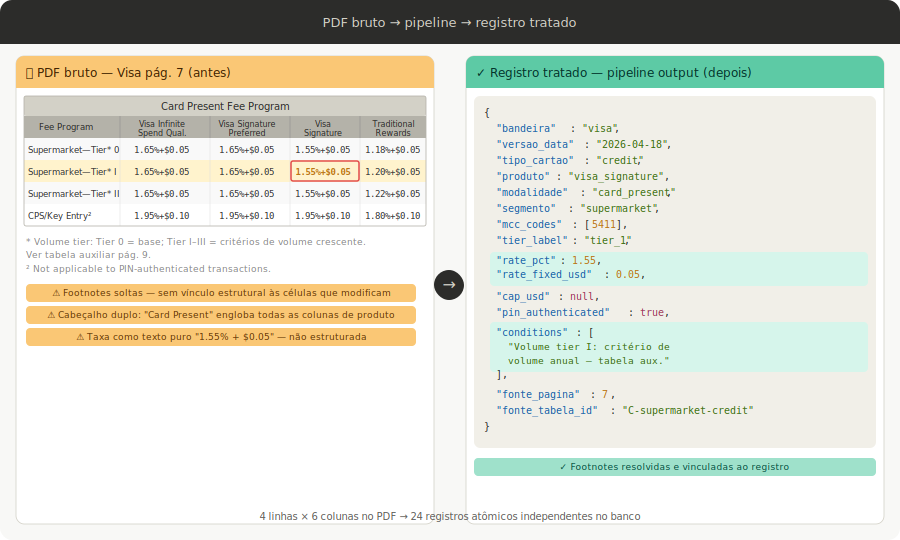
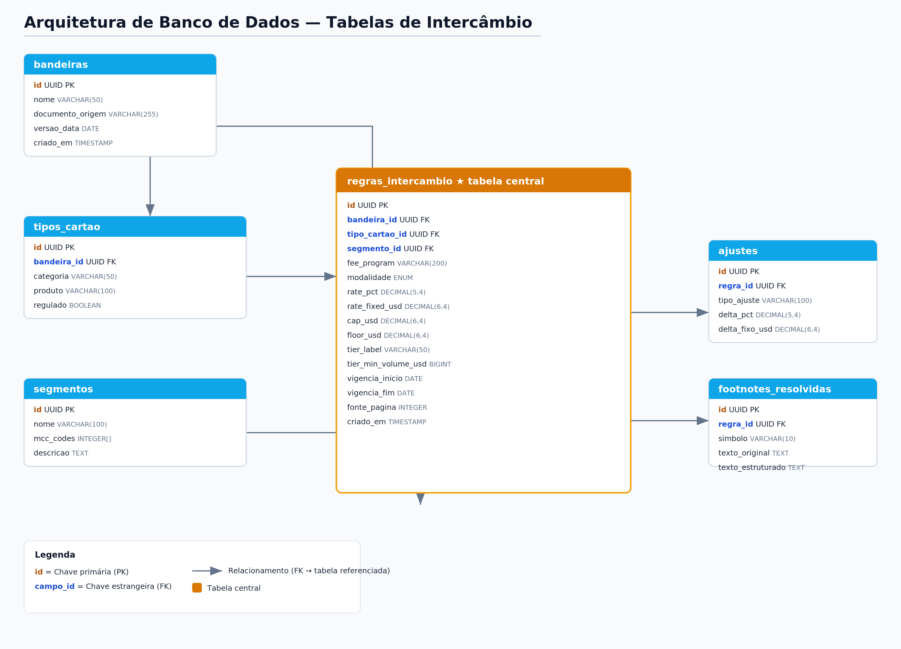

# Proposta Técnica: Pipeline de IA para Extração e Estruturação Automática de Taxas de Intercâmbio — Visa & Mastercard

> **Documento de Entrega — Desafio Técnico Bolsista Doutor Bandeiras**
> Versão 1.0 | Junho 2026

---

## Sumário

1. [Análise Exploratória dos Documentos](#1-análise-exploratória-dos-documentos)
2. [Proposta de Pipeline para Extração e Estruturação](#2-proposta-de-pipeline-para-extração-e-estruturação)
3. [Abordagem Técnica e Modelagem de Banco de Dados](#3-abordagem-técnica-e-modelagem-de-banco-de-dados)
4. [Visualizações Estratégicas e Dashboards](#4-visualizações-estratégicas-e-dashboards)
5. [Recomendações Técnicas para Evolução do Agente de IA](#5-recomendações-técnicas-para-evolução-do-agente-de-ia)

---

## 1. Análise Exploratória dos Documentos

### 1.1 Estrutura Geral dos Manuais

Os manuais de taxas de intercâmbio da Visa e Mastercard são documentos técnicos publicados periodicamente em formato PDF. Para a montagem desse proposta de pipeline foram considerados dois documentos como base:

- **Visa USA Interchange Reimbursement Fees** — versão de 18 de abril de 2026.
- **Mastercard U.S. Region Interchange Programs and Rates 2025–2026** — vigente a partir de 11 de abril de 2025.

Ambos os documentos compartilham uma arquitetura tabular densa, porém com diferenças significativas de nomenclatura, hierarquia e segmentação, conforme detalhado abaixo.

| Característica | Visa | Mastercard |
|---|---|---|
| Número médio de tabelas | ~25–35 | ~20–30 |
| Hierarquia de produto | Infinite / Signature / Traditional / Check / Prepaid | World Elite / World High Value / World / Enhanced Value / Core |
| Dimensão de segmentação | Tipo de cartão × Modalidade (CP/CNP) × MCC | Tipo de cartão × Programa (Merit I, III, Supermarket...) × MCC |
| Formato de taxa | `X.XX% + $Y.YY` com caps opcionais | `X.XX% + Y.YY` com caps opcionais |
| Presença de tiers volumétricos | Sim (Supermarket Tiers 0–III) | Sim (Merit III Tiers 1–3, Supermarket Tiers 1–3) |
| Notas de rodapé críticas | Sim (~3–8 por tabela) | Sim (~4–6 por tabela) |

### 1.2 Padrões Tarifários e Regras de Segmentação

A segmentação dos intercâmbios obedece a múltiplas dimensões simultaneamente. Compreendê-las é fundamental para qualquer pipeline de extração:

**a) Tipo de cartão (Card Product)**
Visa e Mastercard diferenciam claramente cartões de crédito, débito (regulado vs. isento), e pré-pago (regulado vs. isento). A regulação referenciada é o Durbin Amendment (Regulation II), que teto as taxas de débito regulado em `0.05% + $0.21`.

**b) Presença física vs. remoto (Card Present / Card Not Present)**
Todas as tabelas distinguem transações com cartão fisicamente presente (CP) das não-presenciais (CNP), incluindo e-commerce. As taxas CNP são invariavelmente superiores, refletindo maior risco de fraude.

**c) Merchant Category Code (MCC)**
O MCC é o vetor de segmentação mais granular. Exemplos de categorias com tratamento especial:

- **Supermarket** (MCC 5411): Visa pratica taxas diferenciadas por tiers de volume (Tier 0 a III), com variação de `1.18% + $0.05` a `2.00% + $0.07` para crédito. Mastercard segmenta similarmente com Base + Tier 1/2/3.
- **Petroleum/AFD** (Automated Fuel Dispenser — MCCs 5541, 5542): ambas as bandeiras aplicam cap de `$0.95`, independente do percentual calculado.
- **Utilities** (MCCs 4900–4999): Mastercard aplica taxa fixa de `$0.75` por transação, sem componente percentual.
- **Government / Public Sector**: taxas reduzidas com caps explícitos (`$2.00` na Visa, segmento Public Sector na Mastercard com `1.55% + $0.10`).
- **Charities**: ambas praticam taxas preferenciais (`2.00% + $0.10` na Mastercard, independente do tier de produto).
- **Gaming MCCs** (Mastercard: 7800, 7801, 7802, 7994, 7995): taxa de `0.00% + $0.10`, refletindo tratamento de "payment transaction".

**d) Modalidades especiais de transação**

| Modalidade | Visa | Mastercard |
|---|---|---|
| Small Ticket (≤ $10–$15) | Taxa específica, ex: `1.55% + $0.04` débito | Taxa específica, ex: `1.65% + $0.02` crédito CP |
| Contactless | Subsumir nas taxas CP padrão; sem linha separada | Idem |
| Pré-pago isento | Tabela B dedicada (`1.15% + $0.15` base) | Coluna Prepaid Rate na tabela Debit/Prepaid |
| Key-Entered / CNP sem autenticação | Taxas majoradas (`1.65% + $0.15` débito) | `1.95% + $0.10` crédito |
| Full UCAF (e-commerce autenticado) | Taxas preferentes vs. Standard CNP | `1.95% + $0.10` (crédito Core) |
| Debt Repayment | Taxa com caps distintos ($2.00 e $0.65) | N/A como linha separada |

### 1.3 Desafios na Leitura dos PDFs

**Desafio 1 — Tabelas multi-header hierárquicas.**
As tabelas da Visa possuem até três níveis de cabeçalho: (i) seção do documento (ex: "Consumer Credit"), (ii) modalidade (Card Present / Card Not Present), e (iii) produto (Visa Infinite / Signature...). O parser deve resolver essa hierarquia para associar cada célula a seus eixos corretos.

**Desafio 2 — Notas de rodapé como modificadores de regra.**
Asteriscos, superescritos numéricos e letras referenciam condições que alteram o valor principal. Por exemplo, na Visa: `*` indica adicional de `$0.01` para issuers com certificação de prevenção de fraude; `1` restringe a taxa de Small Ticket a transações na rede 002. Ignorar estas notas produz dados incorretos para casos de uso reais.

**Desafio 3 — Caps e valores mínimos embutidos em células.**
A formatação `1.90% + $0.00 (0.95 max)` da Mastercard Petroleum e `0.80% + $0.15 ($0.15 min/$2.00 max)` da Visa exige parsing de estrutura interna da célula, não apenas extração de texto.

**Desafio 4 — Tiers volumétricos com critérios de qualificação em tabelas auxiliares.**
Os critérios de elegibilidade aos tiers (ex: Mastercard Merit III Tier 1 exige volume mínimo anual de USD 1,80 bilhão) aparecem em tabelas separadas dos valores das taxas. O pipeline precisa juntar estas entidades.

**Desafio 5 — Variação de layout entre versões.**
As bandeiras alteram layout, nomenclatura e ordem das tabelas entre publicações semestrais. Um pipeline robusto não pode depender de posições fixas de células.

**Desafio 6 — Conteúdo misto (texto narrativo + tabelas).**
Parágrafos introdutórios e notas legais intercalam-se com as tabelas. O pipeline deve distinguir blocos de prosa dos blocos tabulares.

---

## 2. Proposta de Pipeline para Extração e Estruturação

A arquitetura proposta é inspirada no framework **RAG (Retrieval-Augmented Generation)** e organizada em cinco estágios principais: **Ingestion → Chunking → Embedding → Indexing → Retrieval + LLM**.

```
┌─────────────────────────────────────────────────────────────────────────────┐
│                    PIPELINE DE EXTRAÇÃO — VISÃO GERAL                       │
│                                                                             │
│  [PDF Bandeira] ──► [Ingestão & OCR] ──► [Chunking Estrutural]             │
│                                                ↓                           │
│                              [Extração Semântica via LLM]                  │
│                                                ↓                           │
│                              [Validação & Reconciliação]                   │
│                                                ↓                           │
│                         [Banco de Dados Estruturado]                       │
│                                                ↓                           │
│              [Vector Store para RAG] ◄──── [Embedding]                     │
│                                                ↓                           │
│                    [Agente de Consulta / Dashboard]                        │
└─────────────────────────────────────────────────────────────────────────────┘
```

### 2.1 Estágio 1 — Ingestão do PDF

**Objetivo:** Converter o PDF em representações intermediárias que preservem a estrutura (tabelas, hierarquia de cabeçalhos, notas de rodapé).

**Ferramentas recomendadas:**

| Ferramenta | Papel | Justificativa |
|---|---|---|
| `pdfplumber` | Extração de tabelas com coordenadas de bounding box | Preserva posição de células; lida com tabelas sem bordas explícitas |
| `pymupdf` (fitz) | Extração de texto bruto e detecção de blocos | Alta performance; suporte a metadados de página |
| `unstructured` (Unstructured.io) | Classificação automática de elementos (Table, NarrativeText, Title) | Reduz trabalho de heurística manual |
| `pytesseract` + `OpenCV` | OCR fallback para páginas escaneadas ou com artefatos | Bandeiras ocasionalmente publicam versões não-seleccionáveis |
| `camelot` | Extração alternativa de tabelas lattice/stream | Robusto para tabelas com bordas bem definidas |

**Processo detalhado:**
1. Abertura do PDF via `pdfplumber`; iteração por página.
2. Detecção de blocos tabulares via bounding boxes.
3. Extração de texto narrativo separadamente (seções de introdução, notas legais).
4. Aplicação de OCR seletivo em páginas onde a extração digital falha (verificado por threshold de caracteres reconhecidos por cm²).
5. Saída: lista de objetos `PageBlock` com tipo (`table` | `text` | `footnote`), conteúdo bruto e coordenadas.

A seguir temos um exemplo da extração das informaçãos a partir do PDF:




### 2.2 Estágio 2 — Chunking Estrutural

**Objetivo:** Dividir o conteúdo em unidades semânticas coerentes, preservando contexto hierárquico.

Esta etapa diverge do chunking tradicional de RAG (por tokens) porque o domínio exige **chunking orientado a entidade de regra**, não a parágrafos.

**Estratégia de chunking em três camadas:**

```
Nível 1 — Seção do documento
  └── Nível 2 — Tabela (com todos os seus cabeçalhos resolvidos)
        └── Nível 3 — Linha de regra (uma combinação MCC × Produto × Modalidade × Taxa)
```

Cada **chunk de Nível 3** é a unidade mínima indexável e deve conter:
- Contexto herdado dos níveis superiores (bandeira, tipo de cartão, modalidade)
- Valor da taxa (percentual + fixo + cap, se houver)
- Referências às notas de rodapé aplicáveis (resolvidas em texto)
- Metadados: `page_number`, `table_id`, `version_date`

**Resolução de cabeçalhos hierárquicos:**
```python
# Pseudocódigo de resolução de multi-header
def resolve_headers(raw_table: list[list[str]]) -> list[dict]:
    header_rows = detect_header_rows(raw_table)  
    merged_header = merge_hierarchical_headers(header_rows)
    data_rows = raw_table[len(header_rows):]
    return [
        {col: row[i] for i, col in enumerate(merged_header)}
        for row in data_rows
    ]
```

**Resolução de notas de rodapé:**
As notas são extraídas como entidades separadas no Estágio 1 e linkadas aos chunks por referência de símbolo (`*`, `1`, `2`, `a`, `b`...). Um LLM local via Ollama (ex: llama3.2 ou qwen2.5:3b) é usado para parafrasear a nota em linguagem estruturada e associá-la ao campo conditions de cada regra.

### 2.3 Estágio 3 — Embedding e Indexação

**Objetivo:** Converter chunks em vetores densos para suporte a busca semântica pelo Agente de Consulta.

**Modelo de embedding recomendado:** `text-embedding-3-large` (OpenAI) ou `BAAI/bge-m3` (Hugging Face). Para o domínio financeiro, fine-tuning com exemplos de consultas de analistas é fortemente recomendado.

**Estratégia de indexação:**

| Estratégia | Quando usar | Configuração |
|---|---|---|
| **HNSW** (Hierarchical Navigable Small World) | Operação interativa (Q&A, simulações em tempo real) | Latência < 10ms; dataset < 10M vetores |
| **IVF** (Inverted File Index) | Batch analytics, re-processamento periódico | Corpus estável; controle de memória |

**Vector Store recomendado:** **Qdrant** (open-source, suporte nativo a payload filtering) ou **Weaviate** (com módulo de hybrid search nativo).

**Metadados indexados como payload (para filtragem pré-busca):**
```json
{
  "bandeira": "visa",
  "tipo_cartao": "credit",
  "produto": "visa_signature",
  "modalidade": "card_not_present",
  "segmento": "supermarket",
  "mcc_range": "5411",
  "version_date": "2026-04-18",
  "regulated": false
}
```

**Hybrid Search** (conforme diagrama RAG): combinação de busca vetorial semântica + BM25 lexical. Essencial para consultas com termos técnicos exatos como "Merit III Tier 2" ou "UCAF", que podem não ter boa representação vetorial sem fine-tuning.

### 2.4 Estágio 4 — Extração Semântica via LLM/Agente

**Objetivo:** Usar um LLM como "leitor inteligente" para resolver ambiguidades estruturais e converter tabelas brutas em registros JSON normalizados.

**Arquitetura do agente de extração:**

```
┌─────────────────────────────────────────────────────┐
│              AGENTE DE EXTRAÇÃO (LLM)               │
│                                                     │
│  Tool 1: parse_table_chunk(raw_html_table)          │
│  Tool 2: resolve_footnote(symbol, footnote_text)    │
│  Tool 3: validate_rate_format(rate_string)          │
│  Tool 4: classify_mcc(description)                  │
│  Tool 5: detect_cap_or_floor(cell_text)             │
└─────────────────────────────────────────────────────┘
```

**Prompt de extração (estrutura):**
```
Sistema: Você é um especialista em regulação de meios de pagamento.
Extraia as regras de intercâmbio da tabela abaixo em formato JSON estrito.
Para cada linha, retorne:
  - fee_program (str): nome exato do programa
  - rate_pct (float): percentual (ex: 1.65)
  - rate_fixed (float): valor fixo em USD (ex: 0.15)
  - cap_usd (float | null): teto máximo em USD
  - floor_usd (float | null): piso mínimo em USD
  - conditions (list[str]): condições das notas de rodapé aplicáveis
  - card_present (bool): true = CP, false = CNP
  
Tabela: {raw_table_text}
Notas de rodapé disponíveis: {footnotes}
```

**Modelo recomendado para extração:** LLM local via Ollama com format: "json" (structured output nativo), eliminando necessidade de parsing pós-geração. Para extração de tabelas financeiras densas, recomenda-se modelos de maior capacidade como llama3.1:70b ou qwen2.5:72b — modelos menores tendem a alucinar campos em estruturas hierárquicas complexas.

### 2.5 Estágio 5 — Validação e Reconciliação

**Objetivo:** Garantir integridade dos dados extraídos antes da persistência.

**Camadas de validação:**

1. **Validação de formato:** Verificar que `rate_pct` está entre 0 e 5, `rate_fixed` entre 0 e 2, caps positivos.
2. **Validação de completude:** Toda linha deve ter `fee_program`, `rate_pct` e `rate_fixed`; ausência de qualquer campo dispara alerta.
3. **Validação cruzada entre bandeiras:** Para programas equivalentes (ex: Supermarket CP Crédito), verificar se as taxas estão em faixas esperadas historicamente.
4. **Validação por versão anterior:** Diff automático com a versão anterior do documento; variações acima de 0.5pp são sinalizadas para revisão humana.

**Framework:** `Great Expectations` (Python) para definição e execução de expectativas sobre o dataset resultante; alertas via webhook para o time de dados.

---

## 3. Abordagem Técnica e Modelagem de Banco de Dados

### 3.1 Arquitetura Híbrida: Relacional + Vetorial

Propõe-se uma arquitetura de duas camadas complementares:

- **Banco relacional** (PostgreSQL com extensão `TimescaleDB`) para consultas analíticas determinísticas, simulações e auditoria de versões.
- **Vector Store** (Qdrant) para recuperação semântica pelo Agente RAG.

### 3.2 Esquema Relacional

#### Tabela `bandeiras`
| Campo | Tipo | Descrição |
|---|---|---|
| `id` | UUID PK | Identificador único |
| `nome` | VARCHAR(50) | Ex: "visa", "mastercard" |
| `documento_origem` | VARCHAR(255) | URL ou hash do PDF fonte |
| `versao_data` | DATE | Data de vigência da tabela |
| `criado_em` | TIMESTAMP | Ingestão no sistema |

#### Tabela `tipos_cartao`
| Campo | Tipo | Descrição |
|---|---|---|
| `id` | UUID PK | — |
| `bandeira_id` | UUID FK | Referência à `bandeiras` |
| `categoria` | VARCHAR(50) | Ex: "credit", "debit", "prepaid" |
| `produto` | VARCHAR(100) | Ex: "visa_infinite", "world_elite", "mc_core" |
| `regulado` | BOOLEAN | Sujeito ao Durbin Amendment |

#### Tabela `segmentos`
| Campo | Tipo | Descrição |
|---|---|---|
| `id` | UUID PK | — |
| `nome` | VARCHAR(100) | Ex: "supermarket", "petroleum", "utilities" |
| `mcc_codes` | INTEGER[] | Array de MCCs abrangidos |
| `descricao` | TEXT | Descrição regulatória |

#### Tabela `regras_intercambio` *(tabela central)*
| Campo | Tipo | Descrição |
|---|---|---|
| `id` | UUID PK | — |
| `bandeira_id` | UUID FK | — |
| `tipo_cartao_id` | UUID FK | — |
| `segmento_id` | UUID FK | — |
| `fee_program` | VARCHAR(200) | Nome exato do programa (ex: "CPS/Retail, Debit") |
| `modalidade` | ENUM | `card_present`, `card_not_present` |
| `rate_pct` | DECIMAL(5,4) | Ex: 0.0165 (representa 1.65%) |
| `rate_fixed_usd` | DECIMAL(6,4) | Ex: 0.15 |
| `cap_usd` | DECIMAL(6,4) | Teto máximo; NULL se não aplicável |
| `floor_usd` | DECIMAL(6,4) | Piso mínimo; NULL se não aplicável |
| `tier_label` | VARCHAR(50) | Ex: "tier_1", "base", NULL |
| `tier_min_volume_usd` | BIGINT | Volume mínimo para qualificação; NULL se não tier |
| `vigencia_inicio` | DATE | Início da vigência |
| `vigencia_fim` | DATE | Fim da vigência; NULL = vigente |
| `fonte_pagina` | INTEGER | Página no PDF de origem |
| `criado_em` | TIMESTAMP | — |

#### Tabela `ajustes`
| Campo | Tipo | Descrição |
|---|---|---|
| `id` | UUID PK | — |
| `regra_id` | UUID FK | Referência à `regras_intercambio` |
| `tipo_ajuste` | VARCHAR(100) | Ex: "fraud_prevention_bonus", "ucaf_discount" |
| `delta_pct` | DECIMAL(5,4) | Ex: +0.0001 (+ $0.01 por transação) |
| `delta_fixo_usd` | DECIMAL(6,4) | — |
| `condicao` | TEXT | Descrição da condição de aplicação |

#### Tabela `footnotes_resolvidas`
| Campo | Tipo | Descrição |
|---|---|---|
| `id` | UUID PK | — |
| `regra_id` | UUID FK | — |
| `simbolo` | VARCHAR(10) | Ex: "*", "1", "a" |
| `texto_original` | TEXT | Texto da nota no PDF |
| `texto_estruturado` | TEXT | Paráfrase normalizada pelo LLM |




### 3.3 Consultas Analíticas Ilustrativas

```sql
-- Taxa média ponderada para e-commerce, crédito, por bandeira
SELECT 
    b.nome AS bandeira,
    AVG(r.rate_pct * 100) AS taxa_pct_media,
    AVG(r.rate_fixed_usd) AS fixo_medio_usd
FROM regras_intercambio r
JOIN bandeiras b ON r.bandeira_id = b.id
JOIN tipos_cartao tc ON r.tipo_cartao_id = tc.id
WHERE r.modalidade = 'card_not_present'
  AND tc.categoria = 'credit'
  AND r.vigencia_fim IS NULL
GROUP BY b.nome;

-- Identificar programas com cap ativo por segmento
SELECT fee_program, rate_pct*100 AS pct, rate_fixed_usd, cap_usd
FROM regras_intercambio
WHERE cap_usd IS NOT NULL
ORDER BY segmento_id, bandeira_id;
```

---

## 4. Visualizações Estratégicas e Dashboards

Os dados estruturados no banco relacional alimentam dashboards construídos no **Metabase**, conectados via SQLAlchemy ao PostgreSQL.

### 4.1 Visão Comparativa 1 — Visa vs. Mastercard em E-Commerce (CNP Crédito)

**Tipo de gráfico:** Heatmap de taxa efetiva (% + fixo normalizado para ticket médio de $50)

**Eixos:**
- Eixo Y: Produto de cartão (Core/Enhanced → World → World Elite para MC; Traditional → Signature → Infinite para Visa)
- Eixo X: Segmento de comércio (Retail, Restaurant, Supermarket, T&E, Utilities, Government)
- Cor: Taxa efetiva total em % (calculada como `rate_pct + rate_fixed / ticket_medio`)

**Insight esperado:** Visualizar que Mastercard World Elite e Visa Infinite possuem taxas CNP consideravelmente superiores (~2.55–2.60%) vs. produtos Core (~1.95%), e que categorias como Utilities e Government são substancialmente mais baratas.

**Tabela comparativa embutida (exemplo com dados reais extraídos):**

| Segmento | Visa Infinite CNP | MC World Elite CNP | Δ (pp) |
|---|---|---|---|
| Supermarket | 2.00% + $0.07 | 2.10% + $0.10 | ~+0.13 |
| Restaurant | — | 2.00% + $0.10 | — |
| Petroleum (cap $0.95) | 1.80% + $0.07 | 2.00% + $0.00 | variável |
| Utilities | ~1.65% + $0.15 | $0.75 fixo | — |
| Government | 0.65% + $0.15 (cap $2.00) | 1.55% + $0.10 | — |

### 4.2 Visão Comparativa 2 — Variação de Taxas por MCC e Tipo de Transação

**Tipo de gráfico:** Bar chart agrupado + filtro interativo

**Filtros disponíveis:**
- Bandeira (Visa / Mastercard / Ambas)
- Tipo de cartão (Crédito / Débito / Pré-pago)
- Modalidade (CP / CNP)
- Tier de produto

**Eixos:**
- Eixo Y: Taxa percentual (`rate_pct`)
- Eixo X: MCC / Segmento
- Agrupamento: Bandeira + Produto

**KPIs complementares no dashboard:**
- Número de programas com cap ativo (por bandeira)
- Delta médio CP vs. CNP por categoria
- Distribuição de tiers volumétricos e seus critérios de acesso
- Simulador de custo: dado ticket médio e volume mensal, calcular intercâmbio estimado por bandeira

### 4.3 Visão 3 — Evolução Temporal das Taxas (Multi-versão)

Ao processar múltiplas versões dos documentos (ex: Abril 2025 vs. Abril 2026), o campo `vigencia_inicio/fim` permite construir um **line chart de série temporal** mostrando como as taxas de cada programa evoluíram. Esta visão é especialmente relevante para o time de estratégia identificar tendências de pressão tarifária.

---

## 5. Recomendações Técnicas para Evolução do Agente de IA

### 5.1 Escalabilidade e Processamento em Escala

**Orquestração com Apache Airflow:** Definir DAGs para re-processamento automático quando novos PDFs forem detectados (monitoramento de URL das bandeiras via hash comparison). O pipeline inteiro deve ser idempotente — re-execução com o mesmo PDF não deve duplicar registros.

**Processamento paralelo com Polars:**
```python
import polars as pl

df = pl.read_ndjson("extracted_rules.ndjson")
df_normalized = (
    df
    .with_columns([
        (pl.col("rate_pct") / 100).alias("rate_pct_decimal"),
        pl.col("cap_usd").fill_null(float("inf")).alias("cap_usd_safe"),
    ])
    .filter(pl.col("rate_pct") > 0)
    .sort(["bandeira", "tipo_cartao", "fee_program"])
)
```

**PyTorch para classificação de elementos do PDF:** Um modelo leve de classificação de sequência (BERT fine-tuned) pode aprender a distinguir linhas de cabeçalho, linhas de dados e linhas de subtotal com alta acurácia, substituindo heurísticas frágeis.

### 5.2 Monitoramento de Concept Drift

As bandeiras alteram layout e nomenclatura dos manuais periodicamente. Para detectar estas mudanças automaticamente:

1. **Hash estrutural de tabelas:** Calcular fingerprint do esquema de cada tabela extraída (número de colunas, nomes de cabeçalhos, tipos de dados). Qualquer variação aciona alerta.
2. **Embedding drift:** Comparar o centróide vetorial dos chunks de cada nova versão com a versão anterior. Distância cosine > threshold (≈ 0.15) indica reestruturação semântica relevante.
3. **Relatório de diff automático:** Pipeline gera diff human-readable entre versões, enviado para o time de dados antes da atualização do banco.

**Ferramentas:**  `MLflow` para monitoramento e versionamento de modelos de classificação.

### 5.3 Mecanismos de Atenção e Variáveis Temporais

Para o agente de consulta — que responde perguntas como "qual a taxa de intercâmbio para e-commerce de supermercado com Visa Infinite?" — recomenda-se:

**Cross-Encoder Re-Ranking**: Após a busca vetorial retornar os top-K chunks candidatos, um Cross-Encoder (ex: `cross-encoder/ms-marco-MiniLM-L-6-v2`) re-ranqueia por relevância real à query, eliminando falsos positivos onde a proximidade vetorial não reflete relevância semântica.

**Atenção temporal no RAG:** Incorporar o campo `vigencia_inicio` como metadado de filtragem prioritária. A query do agente deve sempre incluir filtro de vigência:
```python
results = vector_store.search(
    query_vector=embed(query),
    filter={"vigencia_fim": None, "versao_data": {"gte": "2025-04-01"}},
    top_k=10
)
```

**Aprendizado online (Online Learning):** Quando analistas corrigem respostas do agente via feedback, essas correções devem alimentar um dataset de fine-tuning incremental. Implementar com `RLHF lite` usando `trl` (Hugging Face) para ajuste do modelo de re-ranking.

### 5.4 Segurança e Governança de Dados

- **Multi-tenancy:** Implementar isolamento por perfil de usuário (operações, estratégia, comercial) via metadata filtering no Vector Store (estratégia Shared Index + Metadata Filter conforme diagrama RAG).
- **Auditoria:** Toda consulta ao agente é logada com timestamp, query, chunks recuperados e resposta gerada — rastreabilidade completa para conformidade regulatória.
- **PII:** Os documentos das bandeiras não contêm PII, mas integrações futuras com dados de transações próprias exigirão camada de anonymization.

### 5.5 Stack Tecnológica Recomendada — Resumo

| Camada | Tecnologia | Justificativa |
|---|---|---|
| Extração de PDF | `pdfplumber` + `unstructured` | Robustez em tabelas complexas |
| OCR fallback | `pytesseract` + `OpenCV` | Cobertura de PDFs não-digitais |
| Processamento de dados | `Polars` + `PyArrow` | Performance em datasets tabulares |
| LLM de extração | llama3.2 / qwen2.5:3b | Structured output nativo |
| Embedding | `text-embedding-3-large` / `BGE-M3` | Qualidade semântica no domínio |
| Vector Store | `Qdrant` | Payload filtering + HNSW |
| Banco relacional | `PostgreSQL` + `TimescaleDB` | Time-series + analytics SQL |
| Orquestração | `Apache Airflow` | DAGs de re-ingestão automática |
| Monitoramento | `Evidently AI` + `MLflow` | Drift detection + versionamento |
| Dashboard | `Metabase` | Open-source, SQL-native |
| Re-ranking | `Cross-Encoder MiniLM` | Latência aceitável + precisão |
| Framework de validação | `Great Expectations` | Qualidade de dados automatizada |

---

## Considerações Finais

O pipeline proposto endereça os desafios técnicos identificados nos manuais da Visa e Mastercard com uma arquitetura modular, auditável e evolutiva. A combinação de extração estruturada (pdfplumber + LLM), armazenamento híbrido (PostgreSQL + Qdrant) e interface de consulta via RAG com re-ranking entrega tanto a precisão analítica exigida pelas áreas de negócio quanto a flexibilidade semântica necessária para um agente de IA de qualidade produtiva.

A principal aposta arquitetural, tratar cada **linha de regra tarifária como uma entidade indexável com contexto completo**, diferencia este pipeline de abordagens genéricas de RAG e garante que consultas do tipo "qual o intercâmbio para Visa Infinite em supermercado online?" retornem a regra correta, com suas condições e ajustes, sem ambiguidade.

---

**Dr. Ademir Batista dos Santos Neto**
*Cientista de Dados Sênior*
*Junho de 2026*
